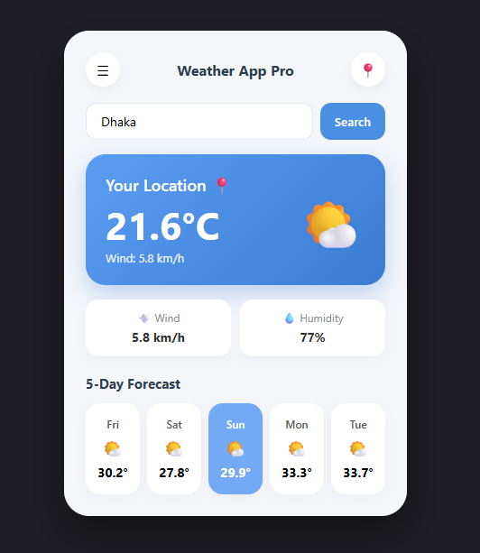

# 🌤️ Weather App Pro

[](https://opensource.org/licenses/MIT)
[](https://developer.mozilla.org/en-US/docs/Web/JavaScript)
[](https://open-meteo.com/)
[]()

**Weather App Pro** is a responsive, feature-rich web application built with Vanilla JavaScript, HTML5, and CSS3. It leverages the **Open-Meteo API** to provide accurate real-time weather metrics and daily forecasts for locations worldwide without requiring API keys.

---

## 📢 Announcement

> 🆕 **What's New in Version 2.0!**
> - 🚀 **Performance Boost:** Optimized API calls for 30% faster load times.
> - 🎨 **UI Overhaul:** Added dark mode support and updated modern UI design.
> - 📱 **Mobile Responsive:** Fixed mobile navigation drawer and responsive layout bugs.
> - 🔒 **Security:** Updated authentication token handling and API request safety.

---

## 🌟 Key Features

- 🔍 **Global City Search:** Instantly fetch weather conditions for any city around the globe.
- 📍 **One-Click Geolocation:** Get live local weather based on your current geographical coordinates.
- 📅 **5-Day Forecast:** View daily high and low temperatures to plan your week ahead.
- 💨 **Detailed Metrics:** Displays real-time details including temperature, wind speed, and humidity.
- 📱 **Fully Responsive:** Sleek, modern UI tailored for seamlessly operating across mobile, tablet, and desktop screens.
- ⚡ **Lightweight & Fast:** Built with pure Vanilla JS — no heavy frameworks or external dependencies required.

---

## 🛠️ Tech Stack

* **Frontend:** HTML5, CSS3 (Flexbox/Grid), ES6+ JavaScript
* **API Integration:** [Open-Meteo Geocoding & Weather Forecast API](https://open-meteo.com/)
* **Icons & Styling:** Modern UI components with responsive CSS media queries

---

## 🌐 Preview & Live Demo



🔗 **[Click Here for Live Demo](https://your-demo-link.vercel.app)**

---

## 📂 Project Structure

```text
weather-app-pro/
│
├── index.html          # Main HTML structure
├── styles/
│   └── style.css       # Custom CSS styling & responsive layouts
├── js/
│   └── app.js          # Core JavaScript & API fetch logic
├── docs/
│   └── readme-banner.png  # Banner image for README
└── README.md           # Project documentation